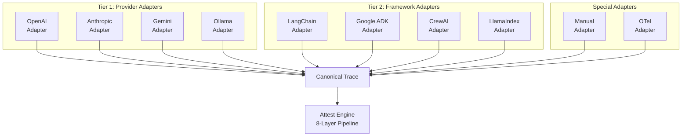
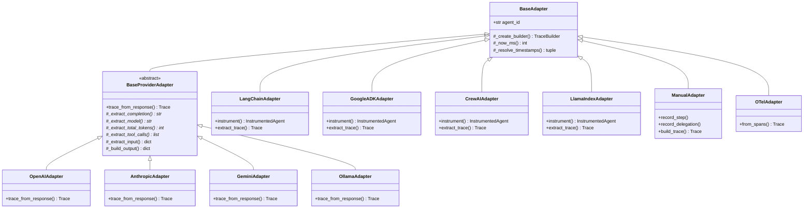

Attest uses a two-tier adapter architecture to capture traces from both LLM provider SDKs and agent orchestration frameworks. All adapters produce the same canonical `Trace` format, making the assertion pipeline framework-agnostic.

## Architecture



The two tiers solve fundamentally different capture problems:

| | Provider Adapters (Tier 1) | Framework Adapters (Tier 2) |
|---|---|---|
| **Captures** | Individual LLM calls, token counts, tool use blocks | Tool call sequences, agent delegation trees, multi-step reasoning |
| **Does not capture** | Agent orchestration, multi-step reasoning, parallel execution | Raw LLM request/response details |
| **Complexity** | ~100 lines per adapter | ~200-400 lines per adapter |
| **Hook mechanism** | Wraps LLM client SDK | Hooks into framework event system |
| **Temporal data** | Wall-clock around LLM call | Framework event timestamps |
| **Agent identity** | Not populated (single-agent context) | Populated from framework metadata |

## Adapter Class Hierarchy



## Tier 1: Provider Adapters

Provider adapters wrap LLM client SDKs to capture individual API calls. They use the **template method pattern** — `BaseProviderAdapter` defines the algorithm skeleton in `trace_from_response()`, and each subclass overrides extraction methods for its provider's response format.

### BaseProviderAdapter

The base class handles:
1. Timestamp resolution (wall-clock fallbacks)
2. TraceBuilder setup with agent ID
3. Input extraction
4. LLM call step construction (model, completion text, token count)
5. Tool call extraction
6. Output and metadata assembly

Subclasses override four abstract methods:

| Method | Returns | Purpose |
|---|---|---|
| `_extract_completion(response)` | `str` | Completion text from provider response |
| `_extract_model(response)` | `str \| None` | Model identifier |
| `_extract_total_tokens(response)` | `int \| None` | Total token count |
| `_extract_tool_calls(response)` | `list[dict]` | Tool calls as `[{"name": ..., "args": ...}]` |

Two optional overrides customize input/output handling:

| Method | Default Behavior |
|---|---|
| `_extract_input(input_messages)` | Wraps in `{"messages": ...}` |
| `_build_output(response, completion_text)` | Returns `{"message": completion_text}` |

### Usage Pattern

```python
from attest import OpenAIAdapter
from openai import OpenAI

client = OpenAI()
adapter = OpenAIAdapter()

# Capture timestamps around the API call
import time
started = int(time.time() * 1000)
response = client.chat.completions.create(
    model="gpt-4.1",
    messages=[{"role": "user", "content": "What is 2+2?"}]
)
ended = int(time.time() * 1000)

# Build trace from response
trace = adapter.trace_from_response(
    response,
    input_messages=[{"role": "user", "content": "What is 2+2?"}],
    started_at_ms=started,
    ended_at_ms=ended,
)
```

### Available Provider Adapters

| Adapter | Provider | Import |
|---|---|---|
| `OpenAIAdapter` | OpenAI (and compatible: Azure, Together AI, vLLM) | `from attest import OpenAIAdapter` |
| `AnthropicAdapter` | Anthropic Claude | `from attest import AnthropicAdapter` |
| `GeminiAdapter` | Google Gemini | `from attest import GeminiAdapter` |
| `OllamaAdapter` | Ollama (local models) | `from attest import OllamaAdapter` |

The `OpenAIAdapter` works with any OpenAI-compatible endpoint by configuring the client's `base_url`.

## Tier 2: Framework Adapters

Framework adapters integrate with agent orchestration frameworks to capture the full execution structure. They hook into framework-specific event systems — callbacks, event streams, or workflow interceptors.

### Interface

Framework adapters implement `instrument()` to wrap an agent/executor and `extract_trace()` to produce the canonical trace:

```python
class FrameworkAdapter:
    @property
    def framework_name(self) -> str:
        """Framework identifier: 'langchain', 'google-adk', etc."""
        ...

    @property
    def supports_parallel(self) -> bool:
        """Whether this framework can express parallel agent execution."""
        return False

    def instrument(self, agent_or_executor) -> InstrumentedAgent:
        """Wrap agent to capture traces while preserving its API."""
        ...

    def extract_trace(self) -> Trace:
        """Extract captured trace in Attest canonical format."""
        ...
```

The `InstrumentedAgent` wrapper delegates all attribute access to the underlying agent via `__getattr__`, so framework-specific methods continue to work.

### Framework Capture Strategies

Each framework exposes different hook points:

#### LangChain

- **Hook:** `BaseCallbackHandler` injected into `AgentExecutor.invoke(config={"callbacks": [handler]})`
- **Parallel support:** No (`AgentExecutor` is sequential)
- **Notes:** "Agents-as-tools" pattern requires tracking callback nesting depth. Tool calls containing LLM calls unfold into `agent_call` steps with sub-traces.

```python
from attest import LangChainAdapter

adapter = LangChainAdapter()
instrumented = adapter.instrument(my_agent_executor)
result = await instrumented.invoke({"input": "Handle this issue"})
trace = adapter.extract_trace()
```

#### Google ADK

- **Hook:** Runner event stream (`session.run()` yields events with agent boundaries)
- **Parallel support:** Yes (`ParallelAgent`)
- **Notes:** `SequentialAgent` produces ordered steps. `ParallelAgent` produces concurrent steps with overlapping temporal intervals. `sub_agents` map to trace tree nesting.

```python
from attest import GoogleADKAdapter

adapter = GoogleADKAdapter()
instrumented = adapter.instrument(my_adk_agent)
result = await instrumented.run("Analyze this incident")
trace = adapter.extract_trace()
```

#### LlamaIndex

- **Hook:** `AgentWorkflow` event listener for agent transitions
- **Parallel support:** No (`AgentWorkflow` manages handoffs sequentially)
- **Notes:** Workflow events provide agent transition boundaries. Each `FunctionAgent` within the workflow becomes a trace tree node.

```python
from attest import LlamaIndexInstrumentationHandler

handler = LlamaIndexInstrumentationHandler()
# Attach to LlamaIndex instrumentation system
```

#### CrewAI

- **Hook:** Task execution callbacks + agent step callbacks
- **Parallel support:** Partial (concurrent tasks within a crew)
- **Notes:** Crew maps to root trace. Each Agent becomes a sub-trace. Task delegation maps to `agent_call` steps.

```python
from attest import CrewAIAdapter

adapter = CrewAIAdapter()
instrumented = adapter.instrument(my_crew)
result = await instrumented.kickoff()
trace = adapter.extract_trace()
```

### Temporal Data Population

Framework adapters populate temporal fields that provider adapters do not:

| Field | Provider Adapter | Framework Adapter |
|---|---|---|
| `started_at_ms` | Wall-clock around LLM call | Framework event timestamp |
| `ended_at_ms` | Wall-clock around LLM call | Framework event timestamp |
| `agent_id` | Not populated | From framework agent metadata |
| `agent_role` | Not populated | From framework agent description |

These fields enable Layer 3 temporal assertions (`agent_ordered_before`, `agents_overlap`, `ordered_agents`) and Layer 7 trace tree analysis.

## Special Adapters

### Manual Adapter

For custom agent implementations that do not use a supported framework. The developer manually records steps and builds the trace:

```python
from attest import ManualAdapter

adapter = ManualAdapter(agent_id="my-agent")
builder = adapter._create_builder()

builder.set_input(messages=[{"role": "user", "content": "Hello"}])
builder.add_llm_call("completion", args={"model": "gpt-4.1"}, result={"completion": "Hi there"})
builder.add_tool_call(name="search", args={"query": "weather"})
builder.set_output(message="The weather is sunny.")

trace = builder.build()
```

### OTel Adapter

Converts OpenTelemetry spans into Attest traces. Use this to test agents instrumented with any OTel-compatible observability platform (Langfuse, Arize, etc.):

```python
from attest import OTelAdapter

adapter = OTelAdapter()
trace = adapter.from_spans(otel_spans)
```

The OTel adapter maps:
- Span `startTimeUnixNano` / `endTimeUnixNano` to `started_at_ms` / `ended_at_ms`
- Span attributes `gen_ai.agent.name` to `agent_id`
- Span name to step name

## Combining Adapters

A framework adapter and a provider adapter can be used together. The framework adapter captures orchestration structure while the provider adapter captures detailed LLM call data:

```python
# Framework adapter captures orchestration structure
lc_adapter = LangChainAdapter()
instrumented = lc_adapter.instrument(my_executor)

# Provider adapter captures detailed LLM call data
oai_adapter = OpenAIAdapter()
wrapped_client = oai_adapter.wrap(my_openai_client)

# Execute with both adapters active
result = await instrumented.run("Handle this issue")

# Merge: framework trace provides structure, provider trace provides LLM detail
trace = attest.merge_traces(
    lc_adapter.extract_trace(),
    oai_adapter.extract_trace()
)
```

The `merge_traces` utility matches LLM call steps by temporal overlap and enriches framework-level steps with provider-level detail (full prompt text, token breakdown, model parameters).

## Implementing a Custom Adapter

### Provider Adapter

To add support for a new LLM provider, subclass `BaseProviderAdapter` and implement four methods:

```python
from attest.adapters._base import BaseProviderAdapter

class MyProviderAdapter(BaseProviderAdapter):
    def _extract_completion(self, response) -> str:
        return response.text

    def _extract_model(self, response, **metadata) -> str | None:
        return response.model_id

    def _extract_total_tokens(self, response) -> int | None:
        return response.usage.total if response.usage else None

    def _extract_tool_calls(self, response) -> list[dict]:
        return [
            {"name": tc.function.name, "args": tc.function.arguments}
            for tc in (response.tool_calls or [])
        ]
```

Then use it:

```python
adapter = MyProviderAdapter()
trace = adapter.trace_from_response(response, input_messages=messages)
```

### Framework Adapter

Framework adapters are more involved. The key steps:

1. Subclass `BaseAdapter`
2. Implement `instrument()` to hook into the framework's event system
3. Collect events into a `TraceBuilder` during execution
4. Implement `extract_trace()` to return the built trace

The LangChain adapter serves as a reference implementation (~300 lines).

## Adapter Inventory

| Adapter | Tier | Captures | Install Extra |
|---|---|---|---|
| `OpenAIAdapter` | Provider | LLM calls, tokens, tool use | `attest-ai[openai]` |
| `AnthropicAdapter` | Provider | LLM calls, tokens, tool use | `attest-ai[anthropic]` |
| `GeminiAdapter` | Provider | LLM calls, tokens, tool use | `attest-ai[gemini]` |
| `OllamaAdapter` | Provider | LLM calls, tokens, tool use | `attest-ai[ollama]` |
| `LangChainAdapter` | Framework | Tools, agents, delegation | `attest-ai[langchain]` |
| `GoogleADKAdapter` | Framework | Tools, agents, parallel groups | `attest-ai[google-adk]` |
| `CrewAIAdapter` | Framework | Tasks, agents, delegation | `attest-ai[crewai]` |
| `LlamaIndexInstrumentationHandler` | Framework | Workflows, agent transitions | `attest-ai[llamaindex]` |
| `ManualAdapter` | Special | Developer-defined steps | (included in base) |
| `OTelAdapter` | Special | OTel spans | `attest-ai[otel]` |
