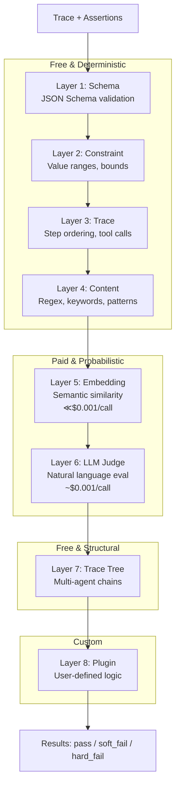
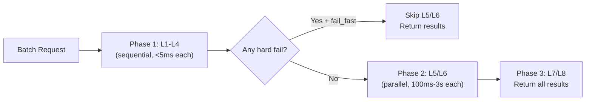
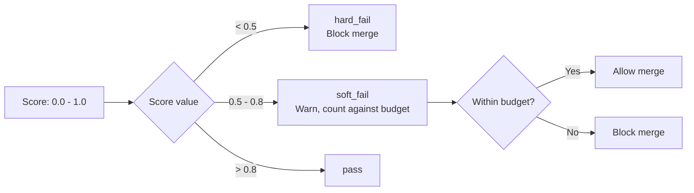

The assertion pipeline is the core evaluation engine in Attest. It processes assertions through eight layers ordered by cost, evaluating the cheapest deterministic checks first and only escalating to expensive probabilistic evaluation when necessary.

## Pipeline Overview



## Evaluation Order

The engine evaluates layers sequentially within a batch. Deterministic layers (L1-L4) run first. If any deterministic assertion hard-fails and `fail_fast` is enabled, the engine skips expensive L5/L6 evaluation entirely.



:::tip
In a well-engineered agent, 60-70% of the testable surface is covered by free Layers 1-4. Design tests to maximize deterministic coverage before reaching for embedding similarity or LLM judges.
:::

## Layer 1: Schema Validation

**Cost:** Free | **Speed:** &lt;1ms | **Deterministic:** Yes

Validates structured data against JSON Schema definitions. Use for tool call arguments, structured output fields, and API response shapes.

### What It Checks

- Tool call arguments match their declared schema
- Agent output conforms to a required structure
- Specific fields exist with correct types

### SDK API

```python
# Output matches a JSON Schema
expect(result).output_matches_schema({
    "type": "object",
    "required": ["response", "confidence"],
    "properties": {
        "response": {"type": "string"},
        "confidence": {"type": "number", "minimum": 0, "maximum": 1}
    }
})

# Tool arguments match schema
expect(result).tool_args_match_schema("process_refund", {
    "type": "object",
    "required": ["order_id", "amount"],
    "properties": {
        "order_id": {"type": "string", "pattern": "^ORD-\\d+$"},
        "amount": {"type": "number", "minimum": 0}
    }
})
```

### Engine Behavior

The engine uses JSON Schema Draft 2020-12 validation. Schema errors produce `hard_fail` with the validation error path and message in the `explanation` field.

## Layer 2: Constraint Checks

**Cost:** Free | **Speed:** &lt;1ms | **Deterministic:** Yes

Evaluates numeric bounds, value ranges, and quantitative constraints on trace metadata and output fields.

### What It Checks

- Token count within budget
- API cost under threshold
- Latency under limit
- Numeric output fields within range
- Step count bounds

### SDK API

```python
# Cost and performance constraints
expect(result).cost_under(0.05)
expect(result).total_tokens_under(3000)
expect(result).latency_under(ms=2000)

# Output field constraints
expect(result).output_field_between("confidence", 0.0, 1.0)
expect(result).step_count_under(15)
```

### Engine Behavior

Constraint violations produce `hard_fail`. The engine extracts the target value from the trace and compares against the specified bounds. Missing fields produce `hard_fail` with an explanation indicating the field was not found.

## Layer 3: Trace Inspection

**Cost:** Free | **Speed:** &lt;1ms | **Deterministic:** Yes

Analyzes the execution trace for structural properties: tool call presence, ordering, loops, state machine transitions, and temporal relationships.

### What It Checks

| Check Type | Description |
|---|---|
| `contains` | Tool was called at least once |
| `not_contains` | Tool was never called |
| `contains_in_order` | Tools called in specified order (other tools may appear between) |
| `exact_order` | Tools called in exact sequence |
| `no_duplicates` | No tool called more than once |
| `loop_detection` | No cyclic tool call patterns |
| `state_transitions` | Execution follows valid state machine transitions |
| `max_steps` | Total step count under limit |
| `max_llm_calls` | LLM call count under limit |
| `agent_ordered_before` | Agent A completed before Agent B started |
| `agents_overlap` | Two agents executed with overlapping time windows |
| `agent_wall_time_under` | Agent total wall time under threshold |
| `ordered_agents` | Agent groups executed in sequential order |

### SDK API

```python
# Tool presence and ordering
expect(result).to_call_tool("lookup_order")
expect(result).to_not_call_tool("delete_account")
expect(result).tool_called_before("check_eligibility", "process_refund")

# Loop and duplicate detection
expect(result).no_duplicate_tool_calls()
expect(result).step_count_under(15)

# State machine transitions
expect(result).follows_transitions({
    "IDENTIFY": {"VERIFY"},
    "VERIFY": {"CHECK_ELIGIBILITY"},
    "CHECK_ELIGIBILITY": {"PROCESS", "DENY"},
})

# Temporal assertions (multi-agent)
expect(result).trace_tree().agent("Critic").started_after("FixProposer")
expect(result).trace_tree().agents("LogAnalyst", "RunbookResearcher").overlap()
expect(result).trace_tree().agent("LogAnalyst").wall_time_under(ms=5000)

# Ordered agent sequences
expect(result).to_follow_agent_order([
    ["LogAnalyst", "RunbookResearcher"],  # parallel group
    "FixProposer",                         # must follow research
    "Critic",                              # must follow proposal
])
```

### Engine Behavior

Trace assertions operate on the `steps` array and optional temporal metadata (`started_at_ms`, `ended_at_ms`). Temporal assertions require adapters to populate timestamp fields — missing temporal data produces `hard_fail` with a diagnostic message.

## Layer 4: Content Pattern Matching

**Cost:** Free | **Speed:** &lt;5ms | **Deterministic:** Near (regex-based)

Matches output text against patterns, keywords, and content rules. Use for verifying the agent mentioned required information, avoided prohibited content, or followed formatting rules.

### What It Checks

- Substring presence or absence
- Regex pattern matching
- PII detection patterns (SSN, credit card, email)
- Keyword lists (must-include or must-exclude)

### SDK API

```python
# Content presence
expect(result).output_contains("ORD-123456")
expect(result).output_contains_any(["refund processed", "refund approved"])

# Content absence
expect(result).output_not_contains("internal_api_key")
expect(result).output_not_contains_any(["jira", "salesforce", "zendesk"])

# Regex patterns
expect(result).output_matches_pattern(r"\$\d+\.\d{2}")  # dollar amount
expect(result).output_not_matches_pattern(r"\b\d{3}-\d{2}-\d{4}\b")  # SSN
```

### Engine Behavior

Content assertions use Go's `regexp` package. Pattern matching is case-sensitive by default. The engine evaluates all content assertions against the `output.message` field of the trace.

## Layer 5: Embedding Similarity

**Cost:** ~$0.001/call | **Speed:** ~100ms | **Deterministic:** Near

Computes semantic similarity between the agent's output and a reference text using embedding vectors. Use when you need to verify meaning without matching exact wording.

### What It Checks

- Output meaning is close to an expected answer
- Response covers required topics
- Denial messages convey the right reason

### SDK API

```python
expect(result).semantically_similar_to(
    "Your order is outside the 30-day return window and is not eligible for a refund.",
    threshold=0.7
)
```

### Engine Behavior

The engine computes cosine similarity between embedding vectors of the output text and the reference text. Embedding provider is configurable via `ATTEST_EMBEDDING_PROVIDER` (options: `auto`, `openai`, `onnx`).

Scores map to the soft failure system:
- `>= threshold` — `pass` with score = similarity value
- `< threshold` and `>= 0.5` — `soft_fail`
- `< 0.5` — `hard_fail`

## Layer 6: LLM-as-Judge

**Cost:** ~$0.01+/call | **Speed:** 1-3s | **Deterministic:** No

Uses an LLM to evaluate subjective qualities: empathy, helpfulness, coherence, faithfulness, tone. This is the most powerful but most expensive and least deterministic layer.

### What It Checks

- Subjective quality dimensions (empathy, professionalism, coherence)
- Faithfulness to source material
- Tone and style compliance
- Complex reasoning evaluation

### SDK API

```python
expect(result).judge_score("empathy", above=0.7)
expect(result).judge_score("helpfulness", above=0.8)
expect(result).judge_score("professionalism", above=0.8)
```

### Engine Behavior

The engine constructs a judge prompt with the agent's output, the evaluation dimension, and a scoring rubric. The judge LLM returns a score from 0.0 to 1.0 with an explanation.

Configuration:
- `ATTEST_JUDGE_PROVIDER` — LLM provider (`openai`, `anthropic`, `gemini`, `ollama`)
- `ATTEST_JUDGE_MODEL` — Model name (e.g., `gpt-4.1`)

:::caution
LLM judges are non-deterministic. The same input can produce different scores across runs. Use the `@repeat(n)` decorator with `pass_at_k` and `consistency_at_k` to measure reliability across multiple evaluations.
:::

## Layer 7: Trace Tree

**Cost:** Free | **Speed:** &lt;5ms | **Deterministic:** Yes

Analyzes the structure of multi-agent execution trees. Use for verifying agent delegation patterns, tree depth, and cross-agent relationships.

### What It Checks

- Agent delegation structure matches expected topology
- Trace tree depth within bounds
- Specific agents present in the tree
- Cross-agent data flow

### SDK API

```python
tree = TraceTree(root=result.trace)

# Verify agents participated
assert "LogAnalyst" in tree.agents
assert "Critic" in tree.agents

# Verify tree depth
assert tree.depth <= 3

# Find specific agent sub-traces
analyst_trace = tree.find_agent("LogAnalyst")
assert analyst_trace is not None
```

### Engine Behavior

Trace tree assertions operate on the nested `sub_trace` fields within `agent_call` steps. The engine traverses the tree to locate agents, compute depth, and verify structural properties.

## Layer 8: Plugin

**Cost:** Varies | **Speed:** Varies | **Deterministic:** Varies

Runs user-defined evaluation logic. Plugins execute outside the engine and submit results back via the `submit_plugin_result` JSON-RPC method.

### What It Checks

- Custom business logic evaluation
- External API validation
- Domain-specific scoring
- Integration with third-party evaluation tools

### SDK API

```python
# Plugin assertions are submitted asynchronously
await client.submit_plugin_result(
    trace_id=trace.trace_id,
    plugin_name="compliance_checker",
    assertion_id="assert_compliance_01",
    status="pass",
    score=0.95,
    explanation="All compliance rules satisfied",
)
```

### Engine Behavior

The engine registers plugin assertions during `evaluate_batch` but does not evaluate them immediately. Instead, it waits for the SDK to submit plugin results via `submit_plugin_result`. The engine correlates results by `assertion_id`.

## Soft Failure Budget

Layers 5 and 6 produce continuous scores (0.0 to 1.0) rather than binary pass/fail. The soft failure system classifies these scores:



Configure the budget per test suite:

```python
# Allow up to 2 soft failures in a test suite before blocking
attest.config.soft_failure_budget = 2
```

## Tier Mapping

The tier system maps assertion layers to cost categories for test scheduling:

| Tier | Layers | Cost per Assertion | Typical Use |
|---|---|---|---|
| **TIER_1** | L1, L2, L3, L4, L7 | Free | Development, every commit |
| **TIER_2** | L5 | ~$0.001 | PR validation |
| **TIER_3** | L6 | ~$0.01+ | Pre-merge, nightly |

```python
from attest import tier, TIER_1

@tier(TIER_1)
async def test_tool_schema(result):
    expect(result).output_matches_schema(schema)
    expect(result).to_call_tool("lookup_order")
    expect(result).output_contains("ORD-123")
```

Run tier-filtered tests:

```bash
# Free tests only (development)
ATTEST_MAX_TIER=1 pytest -m attest

# Include embeddings (PR check)
ATTEST_MAX_TIER=2 pytest -m attest

# Full suite (nightly CI)
pytest -m attest
```

## Batch Evaluation Parallelization

The engine splits batch evaluation into two phases:

1. **Phase 1 (sequential):** Deterministic layers L1-L4 evaluate in sequence. Each takes &lt;5ms.
2. **Phase 2 (parallel):** Probabilistic layers L5-L6 evaluate concurrently with a configurable concurrency limit (default: 4).

This prevents a batch with 5 LLM judge assertions at 2s each from taking 10s sequentially — parallel evaluation brings it to ~2.5s.

| Configuration | Default | Description |
|---|---|---|
| `ATTEST_EVAL_CONCURRENCY` | `4` | Max concurrent L5/L6 evaluations per batch |
| `ATTEST_EVAL_FAIL_FAST` | `true` | Skip L5/L6 if any L1-L4 assertion hard-fails |

:::note
Fail-fast mode is enabled by default. If any free deterministic assertion fails, the engine skips expensive probabilistic evaluation entirely. This keeps failed test runs fast and cheap.
:::
