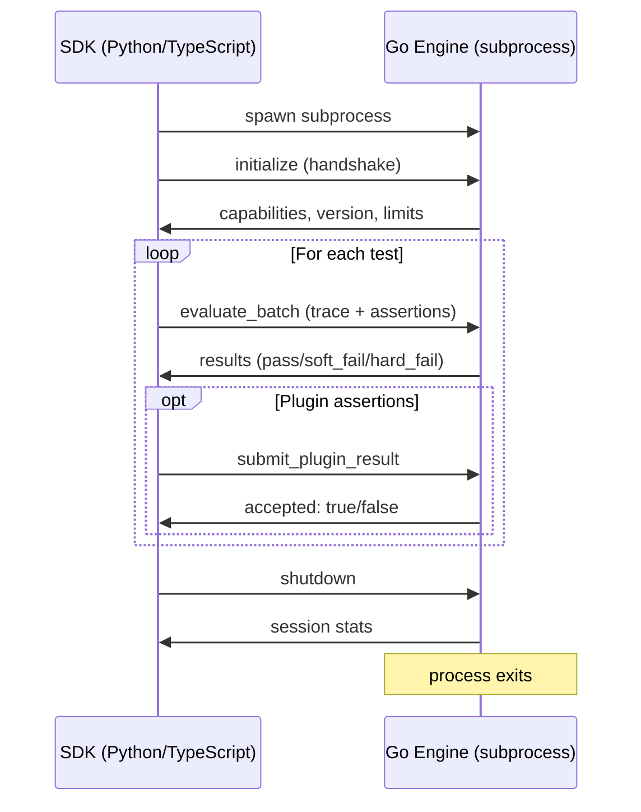
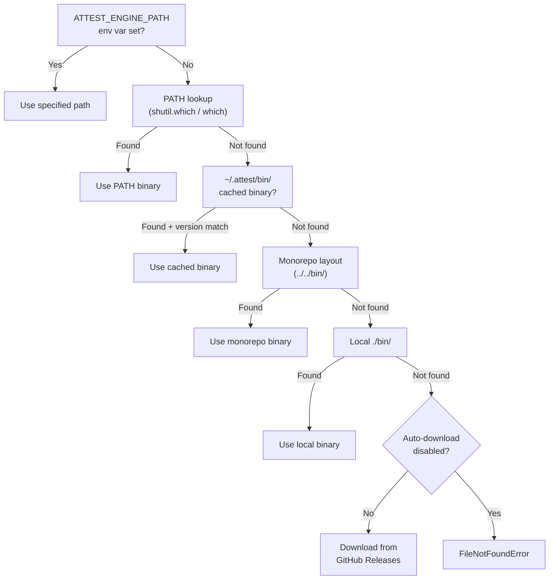

The Attest engine is a Go binary that runs as a subprocess. SDKs communicate with it using **JSON-RPC 2.0** over **NDJSON (newline-delimited JSON) on stdin/stdout**. This page documents the protocol methods, message formats, and lifecycle.

## Protocol Overview



## Transport

- **Direction:** SDK writes to engine's `stdin`, reads from engine's `stdout`
- **Framing:** Each message is a single line of compact JSON terminated by `\n` (NDJSON)
- **Encoding:** UTF-8
- **Concurrency:** Requests are serialized through a write lock. The SDK's reader loop dispatches responses to callers by request ID.

Message format follows JSON-RPC 2.0:

```json
{"jsonrpc":"2.0","id":1,"method":"initialize","params":{...}}
```

Response:

```json
{"jsonrpc":"2.0","id":1,"result":{...}}
```

Error:

```json
{"jsonrpc":"2.0","id":1,"error":{"code":-32600,"message":"...","data":{...}}}
```

## Methods

### `initialize`

Handshake between SDK and engine. Must be the first message after spawning the subprocess.

**Request params:**

```json
{
  "sdk_name": "attest-python",
  "sdk_version": "0.4.2",
  "protocol_version": 1,
  "required_capabilities": ["layers_1_4"],
  "preferred_encoding": "json"
}
```

| Field | Type | Description |
|---|---|---|
| `sdk_name` | string | SDK identifier (`attest-python`, `attest-typescript`) |
| `sdk_version` | string | SDK version (e.g., `0.4.2`) |
| `protocol_version` | int | Protocol version the SDK supports |
| `required_capabilities` | string[] | Capabilities the SDK requires from the engine |
| `preferred_encoding` | string | Preferred message encoding (`json`) |

**Response result:**

```json
{
  "engine_version": "0.4.0",
  "protocol_version": 1,
  "capabilities": ["layers_1_4", "layers_5_6", "trace_tree", "plugins"],
  "missing": [],
  "compatible": true,
  "encoding": "json",
  "max_concurrent_requests": 64,
  "max_trace_size_bytes": 10485760,
  "max_steps_per_trace": 10000
}
```

| Field | Type | Description |
|---|---|---|
| `engine_version` | string | Engine binary version |
| `protocol_version` | int | Protocol version the engine supports |
| `capabilities` | string[] | Available assertion capabilities |
| `missing` | string[] | Requested capabilities the engine cannot provide |
| `compatible` | bool | `true` if all required capabilities are available |
| `encoding` | string | Negotiated message encoding |
| `max_concurrent_requests` | int | Max in-flight requests the engine accepts |
| `max_trace_size_bytes` | int | Max trace size in bytes (default: 10 MB) |
| `max_steps_per_trace` | int | Max steps per trace (default: 10,000) |

If `compatible` is `false`, the SDK raises a `RuntimeError` listing the missing capabilities.

### `evaluate_batch`

Evaluate a batch of assertions against a trace. This is the primary evaluation method.

**Request params:**

```json
{
  "trace": {
    "schema_version": 1,
    "trace_id": "abc-123",
    "agent_id": "customer-service",
    "input": {"messages": [{"role": "user", "content": "Refund order ORD-123"}]},
    "steps": [
      {
        "type": "llm_call",
        "name": "completion",
        "args": {"model": "gpt-4.1"},
        "result": {"completion": "I'll look up that order for you.", "tokens": 150},
        "started_at_ms": 1708617600000,
        "ended_at_ms": 1708617601200
      },
      {
        "type": "tool_call",
        "name": "lookup_order",
        "args": {"order_id": "ORD-123"},
        "result": {"status": "delivered", "amount": 45.99}
      }
    ],
    "output": {"message": "Your refund of $45.99 has been processed."},
    "metadata": {
      "total_tokens": 350,
      "cost_usd": 0.004,
      "latency_ms": 1200,
      "model": "gpt-4.1"
    },
    "parent_trace_id": null
  },
  "assertions": [
    {
      "assertion_id": "assert_a1b2c3d4",
      "type": "schema",
      "spec": {
        "target": "output.structured",
        "schema": {"type": "object", "required": ["message"]}
      }
    },
    {
      "assertion_id": "assert_e5f6g7h8",
      "type": "trace",
      "spec": {
        "check": "contains",
        "tool_name": "lookup_order"
      }
    }
  ]
}
```

**Response result:**

```json
{
  "results": [
    {
      "assertion_id": "assert_a1b2c3d4",
      "status": "pass",
      "score": 1.0,
      "explanation": "Output matches schema",
      "cost": 0.0,
      "duration_ms": 0
    },
    {
      "assertion_id": "assert_e5f6g7h8",
      "status": "pass",
      "score": 1.0,
      "explanation": "Tool 'lookup_order' found in trace steps",
      "cost": 0.0,
      "duration_ms": 0
    }
  ],
  "total_cost": 0.0,
  "total_duration_ms": 1
}
```

Each result in the array corresponds to an assertion from the request, in the same order.

**Result fields:**

| Field | Type | Description |
|---|---|---|
| `assertion_id` | string | Matches the request assertion ID |
| `status` | string | `pass`, `soft_fail`, or `hard_fail` |
| `score` | float | 0.0 to 1.0 (1.0 = full pass) |
| `explanation` | string | Human-readable explanation of the result |
| `cost` | float | USD cost of evaluating this assertion (0.0 for L1-L4) |
| `duration_ms` | int | Evaluation time in milliseconds |

### `submit_plugin_result`

Submit an externally-computed plugin assertion result to the engine.

**Request params:**

```json
{
  "trace_id": "abc-123",
  "plugin_name": "compliance_checker",
  "assertion_id": "assert_plugin_01",
  "result": {
    "assertion_id": "assert_plugin_01",
    "status": "pass",
    "score": 0.95,
    "explanation": "All compliance rules satisfied",
    "cost": 0.0,
    "duration_ms": 45
  }
}
```

**Response result:**

```json
{
  "accepted": true
}
```

The engine correlates plugin results with pending plugin assertions from the most recent `evaluate_batch` call. If the `assertion_id` does not match a pending plugin assertion, `accepted` is `false`.

### `shutdown`

Graceful shutdown. The engine returns session statistics and exits.

**Request params:** `{}`

**Response result:**

```json
{
  "sessions_completed": 1,
  "assertions_evaluated": 47
}
```

After receiving the shutdown response, the SDK terminates the subprocess. If the engine does not respond within 5 seconds, the SDK sends `SIGTERM`. If it still does not exit, the SDK sends `SIGKILL`.

## Assertion Types

Each assertion in an `evaluate_batch` request specifies a `type` and a `spec` object. The engine routes each assertion to the corresponding layer.

| Type | Layer | Spec Fields |
|---|---|---|
| `schema` | L1 | `target`, `schema` |
| `constraint` | L2 | `target`, `op` (`lt`, `gt`, `between`, `eq`), `value` / `min` / `max` |
| `trace` | L3 | `check`, `tool_name`, `tool_names`, `transitions`, `max` |
| `content` | L4 | `check` (`contains`, `not_contains`, `matches`, `not_matches`), `value` / `pattern` / `values` |
| `embedding` | L5 | `reference`, `threshold` |
| `llm_judge` | L6 | `dimension`, `threshold`, `rubric` (optional) |
| `trace_tree` | L7 | `check`, `agent_id`, `agents`, `groups` |

## Error Codes

| Code | Constant | Description |
|---|---|---|
| 1001 | `ERR_INVALID_TRACE` | Trace data is malformed or missing required fields |
| 1002 | `ERR_ASSERTION_ERROR` | Assertion spec is invalid or references non-existent fields |
| 2001 | `ERR_PROVIDER_ERROR` | LLM/embedding provider API call failed |
| 3001 | `ERR_ENGINE_ERROR` | Internal engine error |
| 3002 | `ERR_TIMEOUT` | Operation timed out |
| 3003 | `ERR_SESSION_ERROR` | Session state error (e.g., evaluate before initialize) |

Standard JSON-RPC error codes also apply:

| Code | Description |
|---|---|
| -32700 | Parse error (invalid JSON) |
| -32600 | Invalid request |
| -32601 | Method not found |
| -32602 | Invalid params |
| -32603 | Internal error |

Error responses include an optional `data` field with structured error details:

```json
{
  "error": {
    "code": 2001,
    "message": "OpenAI API call failed",
    "data": {
      "error_type": "provider_error",
      "retryable": true,
      "detail": "Rate limit exceeded. Retry after 2s."
    }
  }
}
```

## Binary Discovery

The SDK locates the engine binary through a discovery chain, checked in order:



The shared cache at `~/.attest/bin/` includes a `.engine-version` marker file. If the cached binary version does not match the SDK's `ENGINE_VERSION` constant, the SDK downloads a fresh binary.

Disable auto-download by setting `ATTEST_ENGINE_NO_DOWNLOAD=1`.

## Engine Lifecycle in Python

The `EngineManager` class manages the subprocess lifecycle:

```python
from attest.engine_manager import EngineManager

# Context manager pattern (recommended)
async with EngineManager() as engine:
    result = await engine.send_request("evaluate_batch", params)

# Manual lifecycle
engine = EngineManager(engine_path="/path/to/attest-engine")
init_result = await engine.start()
# ... use engine ...
await engine.stop()
```

The `AttestClient` wraps `EngineManager` with request ID generation and asyncio-future-based response correlation:

```python
from attest.client import AttestClient

client = AttestClient(engine)
client.start_reader()  # Background reader loop

results = await client.evaluate_batch(trace, assertions)

await client.stop_reader()
```

## Simulation Mode

Set `ATTEST_SIMULATION=1` to bypass the engine entirely. The SDK returns deterministic `pass` results with `score=1.0` for all assertions without spawning a subprocess or making API calls.

```bash
ATTEST_SIMULATION=1 pytest -m attest -v
```

This enables:
- CI pipeline testing without engine binaries
- Rapid test development without provider credentials
- Example validation in documentation builds

## Protocol Versioning

The protocol version is negotiated during `initialize`. The SDK sends its `protocol_version` and the engine responds with its own. Both sides must support the same version for compatibility.

Current protocol version: **1**

The protocol follows a forward-compatibility rule: **ignore unknown fields**. Adding new optional fields to existing messages does not require a protocol version bump. Only breaking changes (removing fields, changing semantics) increment the version.
