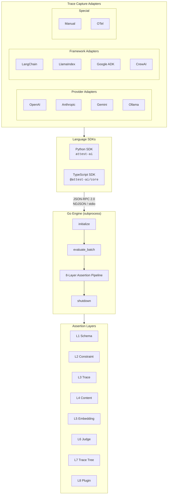
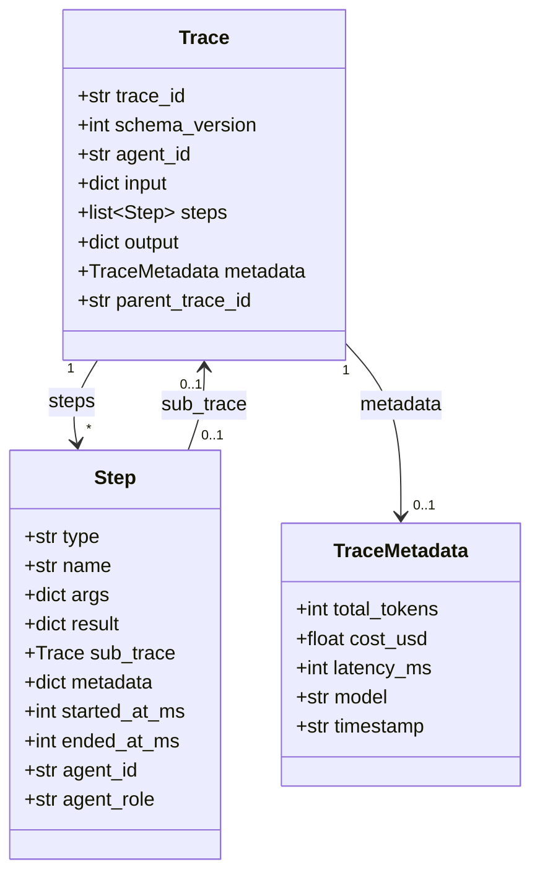
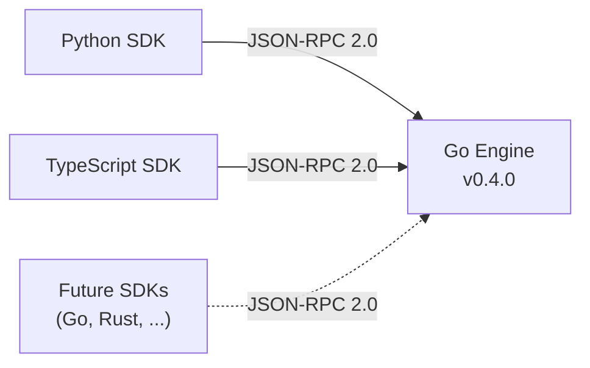

Attest is a testing framework for AI agents built on a three-layer architecture: language-specific SDKs capture agent execution as traces, a Go engine evaluates assertions against those traces, and adapters bridge the gap between LLM providers or agent frameworks and the canonical trace format.

## Architecture Diagram



## Design Principles

Seven principles govern the framework's design and API surface.

### 1. Test Outcomes, Not Paths

Agents are non-deterministic. The same input can produce different tool call sequences that are all correct. Attest asserts on **what was achieved and what constraints were respected**, not on the specific execution path.

```python
# Asserts that both tools were called and that eligibility
# was checked before processing — regardless of other ordering
expect(result).to_call_tool("lookup_order")
expect(result).to_call_tool("check_eligibility")
expect(result).tool_called_before("check_eligibility", "process_refund")
```

### 2. Cheapest Valid Assertion First

The 8-layer pipeline is ordered by cost. Layers 1-4 are free and deterministic. Layer 5 costs ~$0.001. Layer 6 costs ~$0.01+. The API is designed so developers naturally reach for cheaper layers first.

In a well-engineered agent, **60-70% of the testable surface is deterministic** — tool call schemas, guardrail enforcement, structured output validation, state machine transitions, cost budgets. LLM-as-judge is the last resort, not the default.

### 3. Soft Failures Are First-Class

LLM-based assertions produce scores, not booleans. Attest introduces soft failures:

| Score Range | Classification | CI Behavior |
|---|---|---|
| `< 0.5` | Hard fail | Block merge |
| `0.5 - 0.8` | Soft fail | Warn, allow merge if within budget |
| `> 0.8` | Pass | Continue |

Soft failure budgets are configurable per test suite and per CI pipeline.

### 4. Code-First, Not Config-First

Tests are written in code (Python or TypeScript), not YAML or UI dashboards. The test file is the source of truth — version-controlled, reviewed in PRs, run in CI.

```python
async def test_processes_eligible_refund(result):
    expect(result).output_matches_schema(refund_schema)
    expect(result).to_call_tool("process_refund")
    expect(result).output_contains("ORD-123456")
    expect(result).cost_under(0.10)
```

### 5. Simulation Is Built-In

Set `ATTEST_SIMULATION=1` to run tests without an engine binary or real LLM API calls. The SDK returns deterministic pass results for all assertions, enabling rapid iteration and CI pipeline validation without provider credentials.

### 6. Framework-Agnostic

The integration surface is the **trace**. Any system that can produce a trace in Attest's canonical format is testable. Adapters handle the translation from provider-specific or framework-specific events into the canonical `Trace` structure.

### 7. Cost Is a Test Metric

Every test run tracks token consumption, API costs, and latency. Cost assertions sit alongside correctness assertions:

```python
expect(result).cost_under(0.05)
expect(result).total_tokens_under(3000)
```

## Component Overview

### Language SDKs

| SDK | Package | Runtime | Status |
|---|---|---|---|
| Python | `attest-ai` (PyPI) | Python 3.10+ | Stable (v0.4.2) |
| TypeScript | `@attest-ai/core` (npm) | Node 18+ | Stable (v0.4.2) |

Both SDKs provide the same core API surface: `expect()` fluent DSL, `TraceBuilder`, `TraceTree`, adapter base classes, tier system, and engine lifecycle management via `EngineManager`.

### Go Engine

A statically-compiled Go binary (`attest-engine`) that runs as a subprocess. The SDK communicates with it over **JSON-RPC 2.0** transported as **NDJSON over stdin/stdout**.

The engine handles all assertion evaluation — from JSON Schema validation (Layer 1) through LLM-as-judge scoring (Layer 6). This architecture separates the hot evaluation path (Go) from the developer-facing API (Python/TypeScript).

Binary discovery chain:
1. `ATTEST_ENGINE_PATH` environment variable
2. `PATH` lookup
3. `~/.attest/bin/` shared cache (version-checked)
4. Monorepo dev layout
5. Local `./bin/`
6. Auto-download from GitHub Releases

### Assertion Pipeline

Eight layers evaluated in order, cheapest first. Layers 1-4 and 7 are free and deterministic. Layer 5 uses embeddings (~$0.001/call). Layer 6 uses an LLM judge (~$0.01+/call). Layer 8 runs custom plugin logic.

See [Assertion Pipeline](/architecture/assertion-pipeline/) for the full deep dive.

### Adapter System

Two tiers of adapters capture traces from different integration points:

- **Provider adapters** (OpenAI, Anthropic, Gemini, Ollama) wrap LLM client SDKs to capture individual API calls, token counts, and tool use.
- **Framework adapters** (LangChain, LlamaIndex, Google ADK, CrewAI) hook into agent orchestration frameworks to capture tool call sequences, agent delegation trees, and multi-step reasoning.

See [Adapter System](/architecture/adapter-system/) for the full architecture.

## Trace Data Model

The `Trace` is the central data structure. Every agent interaction produces a trace containing input, execution steps, output, and metadata.



### Step Types

| Type | Constant | Description |
|---|---|---|
| LLM Call | `llm_call` | A call to an LLM provider API |
| Tool Call | `tool_call` | Execution of a tool/function |
| Retrieval | `retrieval` | Document or vector search operation |
| Agent Call | `agent_call` | Delegation to a sub-agent (contains `sub_trace`) |

### Temporal Fields

Steps carry optional temporal metadata for multi-agent analysis:

- `started_at_ms` / `ended_at_ms` — wall-clock timestamps for ordering and overlap detection
- `agent_id` / `agent_role` — stable identifiers for agent-level assertions

Provider adapters populate timestamps from wall-clock around LLM calls. Framework adapters populate timestamps and agent identity from framework event metadata.

## Tier System

Tests are tagged with tiers that map to assertion cost:

| Tier | Layers | Cost | Use Case |
|---|---|---|---|
| `TIER_1` | L1-L4, L7 | Free | Schema, constraint, trace, content, trace tree |
| `TIER_2` | L5 | ~$0.001/assertion | Embedding similarity |
| `TIER_3` | L6 | ~$0.01+/assertion | LLM-as-judge scoring |

```python
from attest import tier, TIER_1, TIER_2, TIER_3

@tier(TIER_1)
async def test_schema_compliance(result):
    expect(result).output_matches_schema(schema)

@tier(TIER_3)
async def test_response_empathy(result):
    expect(result).judge_score("empathy", above=0.7)
```

Run only free tests in development, escalate to full suite in CI:

```bash
# Development: fast, free tests only
ATTEST_MAX_TIER=1 pytest -m attest

# CI pipeline: full suite including LLM judge
pytest -m attest
```

## Multi-SDK Strategy

Both SDKs share the same engine binary and protocol. The engine is language-agnostic — any client that speaks JSON-RPC 2.0 over NDJSON/stdio can drive it.



SDK versions and engine versions are **decoupled**. Both SDKs at v0.4.2 work with engine v0.4.0. The engine binary is cached in `~/.attest/bin/` with a `.engine-version` marker file for version validation.
